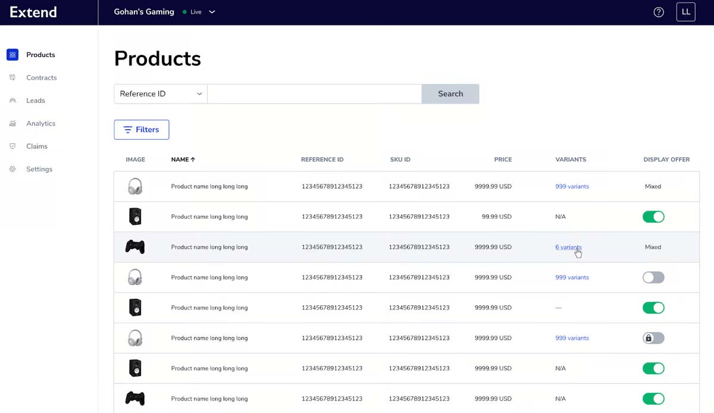
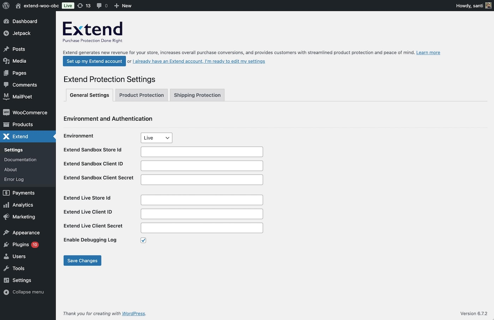

# Extend Protection For WooCommerce

Extend helps merchants generate revenue and protect customers from damage and loss through modern product and shipping protection solutions.

## 🚀 Description

### About Extend
Extend helps merchants generate revenue and protect customers from damage and loss with modern product and shipping protection solutions. No cost. Total profit. Win-win.

### Extend Products
- **Extend Product Protection**: Repairs or replaces products that fail or are accidentally damaged. Customers buy again, merchants boost revenue.
- **Extend Shipping Protection**: Provides refunds if packages are lost, stolen, or damaged. Customers buy again, merchants boost revenue.

## ✅ Installation

### Minimum Requirements
- PHP 7.4 or greater (PHP 8.0+ recommended)
- MySQL 5.6 or greater
- WooCommerce 7.0 or greater

Visit the [Extend Documentation](https://docs.extend.com/docs/welcome-to-extend) for more about the Extend API.

### Automatic Installation
- Log in to your WordPress dashboard
- Navigate to **Plugins → Add New**
- Search for **"Extend Protection For WooCommerce"**
- Click **Install Now**, then **Activate**

### Manual Installation
- Download and upload the plugin via FTP
- Follow [manual plugin installation instructions](https://wordpress.org/support/article/managing-plugins/#manual-plugin-installation)

### Updating
Automatic updates are supported. Always back up your site before updating.

## ❓ Frequently Asked Questions

### What is Extend?
Extend helps merchants generate revenue and protect customers from product damage or loss through modern product and shipping protection.

### What is required for the plugin to work?
- WooCommerce 7.0+
- Extend account and API key

Learn more on the [Extend Documentation](https://docs.extend.com/docs/welcome-to-extend).

## 🌐 External Services
The plugin communicates with Extend services:
- [Extend API](https://docs.extend.com/reference/ordersupsert-1): Manages protection plans, contracts, claims, and leads.
- [Extend SDK](https://helloextend.github.io/extend-sdk-client): Renders protection offers.
- [Extend Merchant Portal](https://merchants.extend.com): Manage products, plans, contracts, and performance reporting.

### Actions Triggered:
- `woocommerce_checkout_order_processed`
- `woocommerce_order_status_completed`

These send order details to Extend for contract creation and customer notification.

### Legal
- [Terms of Service](https://www.extend.com/terms)
- [Privacy Policy](https://www.extend.com/privacy)

## 🖼️ Screenshots

*Kaley is our automated claims agent, adjudicating 98% of claims instantly.*

*Sell protection plans online, in-store, and in-app.*

*Extend's Merchant Portal for managing products, plans, and reports.*

*Extend's settings page in the WordPress admin.*

## 📋 Changelog

### 1.0
- Initial release of Extend Protection For WooCommerce
- Supports product and shipping protection

